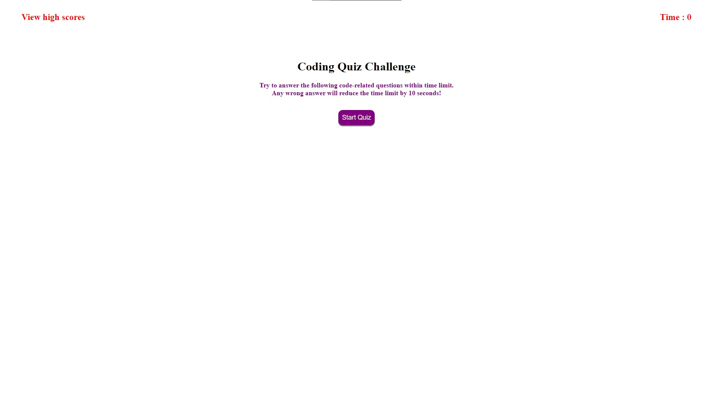

# Code-Quiz

## Purpose:
The purpose for this application is to build a timed coding quiz that will punish incorrect answers. The application will run in the browser and will feature HTML and CSS, powered by JavaScript that is written. 

## Description:
When the "Start Quiz" button is clicked, the user will be given 75 seconds to start. 
There is a total of 5 questions, additionally there is a penalty of -10 seconds for each incorrect answer. 
When all the questions are answered or timer reaches to zero then the game is over.While last couple of seconds remaining,if user answers last question with wrong answer, then the final score will be zero and not negative. 
When the game is over, user can save initials and score.
On click of view high score link user will be shown list of all the high scores. On click of clear high scores, all the saved scores will be removed.
On click of Go back button, user will be directed to main page and can start taking a code quiz.

## User Story
AS A coding boot camp student
I WANT to take a timed quiz on JavaScript fundamentals that stores high scores
SO THAT I can gauge my progress compared to my peers

## Acceptance crieteria:
GIVEN I am taking a code quiz
WHEN I click the start button
THEN a timer starts and I am presented with a question
WHEN I answer a question
THEN I am presented with another question
WHEN I answer a question incorrectly
THEN time is subtracted from the clock
WHEN all questions are answered or the timer reaches 0
THEN the game is over
WHEN the game is over
THEN I can save my initials and score

## Mock-Up
The following animation demonstrates the application functionality:

    

## Built With
* HTML
* CSS
* JavaScript